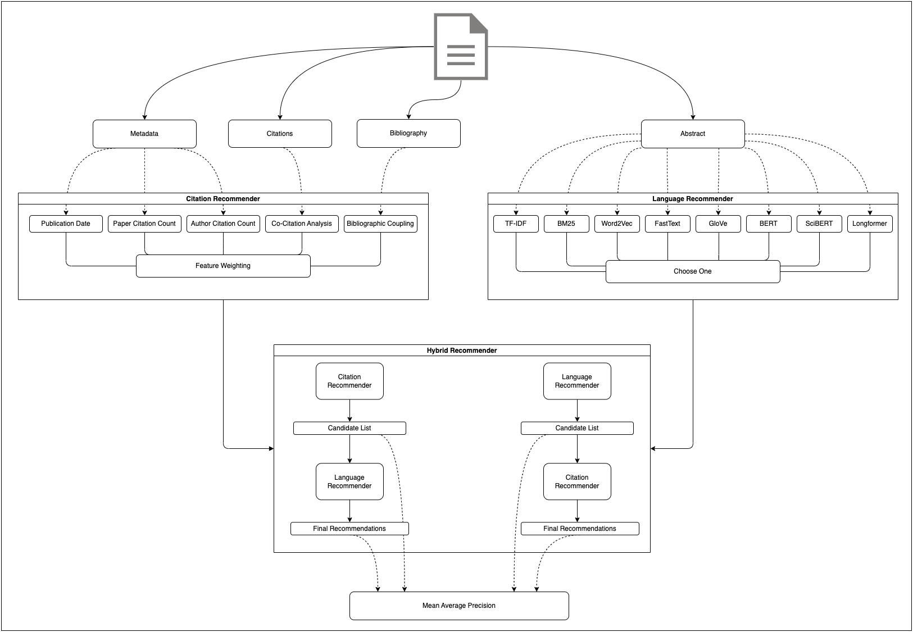

# readnext

[](https://github.com/joel-beck/readnext/actions/workflows/pre-commit.yaml)
[](https://github.com/joel-beck/readnext/actions/workflows/tests.yaml)
[](https://codecov.io/github/joel-beck/readnext)
[](https://pdm.fming.dev)
[](https://joel-beck.github.io/readnext/)
[](https://github.com/joel-beck/readnext)


The `readnext` package provides a hybrid recommender system for computer science papers.
Its main objective is to suggest relevant research papers based on a given query document you might be currently exploring, streamlining your journey to discover more intriguing academic literature.

It is part of my master's thesis at the University of Göttingen supervised by [Corinna Breitinger](https://gipplab.org/team/corinna-breitinger/) and [Terry Ruas](https://gipplab.org/team/dr-terry-lima-ruas/).

The project is under active development.
Below you find the installation instructions and a brief overview of the package.
Check out the [documentation](https://joel-beck.github.io/readnext/) for background information about the citation-based methods and language models that are used in this project as well as details how to reproduce all results and customize the package to your individual needs.

## Quick Look

```python
from readnext import readnext, LanguageModelChoice, FeatureWeights

result = readnext(
    # `Attention is all you need` query paper
    arxiv_url="https://arxiv.org/abs/1706.03762",
    language_model_choice=LanguageModelChoice.FASTTEXT,
    feature_weights=FeatureWeights(
        publication_date=1,
        citationcount_document=2,
        citationcount_author=0.5,
        co_citation_analysis=2,
        bibliographic_coupling=2,
    ),
)

print(result.recommendations.language_to_citation.head(10))
```

| candidate_d3_document_id | weighted_points | title                                                                                                           | author            | arxiv_labels                        | integer_label | semanticscholar_url                                                            | arxiv_url                        | publication_date | publication_date_points | citationcount_document | citationcount_document_points | citationcount_author | citationcount_author_points | co_citation_analysis_score | co_citation_analysis_points | bibliographic_coupling_score | bibliographic_coupling_points |
| -----------------------: | --------------: | :-------------------------------------------------------------------------------------------------------------- | :---------------- | :---------------------------------- | ------------: | :----------------------------------------------------------------------------- | :------------------------------- | :--------------- | ----------------------: | ---------------------: | ----------------------------: | -------------------: | --------------------------: | -------------------------: | --------------------------: | ---------------------------: | ----------------------------: |
|                 11212020 |            80.3 | Neural Machine Translation by Jointly Learning to Align and Translate                                           | Yoshua Bengio     | ['cs.CL' 'cs.LG' 'cs.NE' 'stat.ML'] |             1 | https://www.semanticscholar.org/paper/fa72afa9b2cbc8f0d7b05d52548906610ffbb9c5 | https://arxiv.org/abs/1409.0473  | 2014-09-01       |                       0 |                  19996 |                            88 |               372099 |                         100 |                         45 |                          93 |                            4 |                            95 |
|                  7961699 |            70.9 | Sequence to Sequence Learning with Neural Networks                                                              | Ilya Sutskever    | ['cs.CL' 'cs.LG']                   |             1 | https://www.semanticscholar.org/paper/cea967b59209c6be22829699f05b8b1ac4dc092d | https://arxiv.org/abs/1409.3215  | 2014-09-10       |                       0 |                  15342 |                            83 |               234717 |                           0 |                         25 |                          86 |                            5 |                            97 |
|                  1629541 |            58.9 | Fully convolutional networks for semantic segmentation                                                          | Trevor Darrell    | ['cs.CV']                           |             0 | https://www.semanticscholar.org/paper/317aee7fc081f2b137a85c4f20129007fd8e717e | https://arxiv.org/abs/1411.4038  | 2014-11-14       |                       0 |                  25471 |                            91 |               142117 |                           0 |                         20 |                          81 |                            0 |                            49 |
|                206593880 |            57.9 | Rethinking the Inception Architecture for Computer Vision                                                       | Christian Szegedy | ['cs.CV']                           |             0 | https://www.semanticscholar.org/paper/23ffaa0fe06eae05817f527a47ac3291077f9e58 | https://arxiv.org/abs/1512.00567 | 2015-12-02       |                       0 |                  16562 |                            85 |               128072 |                           0 |                         21 |                          83 |                            0 |                            49 |
|                 10716717 |            56.8 | Feature Pyramid Networks for Object Detection                                                                   | Kaiming He        | ['cs.CV']                           |             0 | https://www.semanticscholar.org/paper/b9b4e05faa194e5022edd9eb9dd07e3d675c2b36 | https://arxiv.org/abs/1612.03144 | 2016-12-09       |                       0 |                  10198 |                            70 |               251467 |                           0 |                         14 |                          71 |                            1 |                            72 |
|                  6287870 |            55.7 | TensorFlow: A system for large-scale machine learning                                                           | J. Dean           | ['cs.DC' 'cs.AI']                   |             0 | https://www.semanticscholar.org/paper/46200b99c40e8586c8a0f588488ab6414119fb28 | https://arxiv.org/abs/1605.08695 | 2016-05-27       |                       0 |                  13266 |                            77 |               115104 |                           0 |                          4 |                          33 |                            7 |                            99 |
|                  3429309 |            52.8 | DeepLab: Semantic Image Segmentation with Deep Convolutional Nets, Atrous Convolution, and Fully Connected CRFs | A. Yuille         | ['cs.CV']                           |             0 | https://www.semanticscholar.org/paper/cab372bc3824780cce20d9dd1c22d4df39ed081a | https://arxiv.org/abs/1606.00915 | 2016-06-02       |                       0 |                   9963 |                            69 |                64894 |                           0 |                          9 |                          57 |                            1 |                            72 |
|                  4555207 |            52.8 | MobileNetV2: Inverted Residuals and Linear Bottlenecks                                                          | Liang-Chieh Chen  | ['cs.CV']                           |             0 | https://www.semanticscholar.org/paper/dd9cfe7124c734f5a6fc90227d541d3dbcd72ba4 | https://arxiv.org/abs/1801.04381 | 2018-01-13       |                       0 |                   7925 |                            56 |                39316 |                           0 |                         10 |                          60 |                            2 |                            82 |
|                 13740328 |            52.5 | Delving Deep into Rectifiers: Surpassing Human-Level Performance on ImageNet Classification                     | Kaiming He        | ['cs.CV' 'cs.AI' 'cs.LG']           |             1 | https://www.semanticscholar.org/paper/d6f2f611da110b5b5061731be3fc4c7f45d8ee23 | https://arxiv.org/abs/1502.01852 | 2015-02-06       |                       0 |                  12933 |                            76 |               251467 |                           0 |                          6 |                          49 |                            1 |                            72 |
|                225039882 |            52.3 | An Image is Worth 16x16 Words: Transformers for Image Recognition at Scale                                      | Jakob Uszkoreit   | ['cs.CV' 'cs.AI' 'cs.LG']           |             1 | https://www.semanticscholar.org/paper/268d347e8a55b5eb82fb5e7d2f800e33c75ab18a | https://arxiv.org/abs/2010.11929 | 2020-10-22       |                       0 |                   5519 |                            16 |                51813 |                           0 |                        185 |                          98 |                            2 |                            82 |


See the [Usage](#usage) section for more details and examples.

## Quick Look

```python
from readnext import readnext, LanguageModelChoice, FeatureWeights

result = readnext(
    # `Attention is all you need` query paper
    arxiv_url="https://arxiv.org/abs/1706.03762",
    language_model_choice=LanguageModelChoice.FASTTEXT,
    feature_weights=FeatureWeights(
        publication_date=1,
        citationcount_document=2,
        citationcount_author=0.5,
        co_citation_analysis=2,
        bibliographic_coupling=2,
    ),
)

print(result.recommendations.language_to_citation.head(10))
```

| candidate_d3_document_id | weighted_points | publication_date_points | citationcount_document_points | citationcount_author_points | co_citation_analysis_points | bibliographic_coupling_points | title                                                                                                           | author           | arxiv_labels                        | semanticscholar_url                                                            | arxiv_url                        | integer_label | publication_date | citationcount_document | citationcount_author | co_citation_analysis_score | bibliographic_coupling_score |
| -----------------------: | --------------: | ----------------------: | ----------------------------: | --------------------------: | --------------------------: | ----------------------------: | :-------------------------------------------------------------------------------------------------------------- | :--------------- | :---------------------------------- | :----------------------------------------------------------------------------- | :------------------------------- | ------------: | :--------------- | ---------------------: | -------------------: | -------------------------: | ---------------------------: |
|                 11212020 |            76.9 |                       0 |                            88 |                          56 |                          93 |                          93.5 | Neural Machine Translation by Jointly Learning to Align and Translate                                           | Yoshua Bengio    | ['cs.CL' 'cs.LG' 'cs.NE' 'stat.ML'] | https://www.semanticscholar.org/paper/fa72afa9b2cbc8f0d7b05d52548906610ffbb9c5 | https://arxiv.org/abs/1409.0473  |             1 | 2014-09-01       |                  19996 |               372099 |                         45 |                            4 |
|                  7961699 |            70.8 |                       0 |                            83 |                           0 |                          86 |                          96.5 | Sequence to Sequence Learning with Neural Networks                                                              | Ilya Sutskever   | ['cs.CL' 'cs.LG']                   | https://www.semanticscholar.org/paper/cea967b59209c6be22829699f05b8b1ac4dc092d | https://arxiv.org/abs/1409.3215  |             1 | 2014-09-10       |                  15342 |               234717 |                         25 |                            5 |
|                  6287870 |            54.8 |                       0 |                            77 |                           0 |                          30 |                          98.5 | TensorFlow: A system for large-scale machine learning                                                           | J. Dean          | ['cs.DC' 'cs.AI']                   | https://www.semanticscholar.org/paper/46200b99c40e8586c8a0f588488ab6414119fb28 | https://arxiv.org/abs/1605.08695 |             0 | 2016-05-27       |                  13266 |               115104 |                          4 |                            7 |
|                 10716717 |            53.6 |                       0 |                            70 |                           0 |                          70 |                            61 | Feature Pyramid Networks for Object Detection                                                                   | Kaiming He       | ['cs.CV']                           | https://www.semanticscholar.org/paper/b9b4e05faa194e5022edd9eb9dd07e3d675c2b36 | https://arxiv.org/abs/1612.03144 |             0 | 2016-12-09       |                  10198 |               251467 |                         14 |                            1 |
|                  4555207 |            51.3 |                       0 |                            56 |                           0 |                          59 |                          77.5 | MobileNetV2: Inverted Residuals and Linear Bottlenecks                                                          | Liang-Chieh Chen | ['cs.CV']                           | https://www.semanticscholar.org/paper/dd9cfe7124c734f5a6fc90227d541d3dbcd72ba4 | https://arxiv.org/abs/1801.04381 |             0 | 2018-01-13       |                   7925 |                39316 |                         10 |                            2 |
|                225039882 |            51.1 |                       0 |                            16 |                           0 |                          98 |                          77.5 | An Image is Worth 16x16 Words: Transformers for Image Recognition at Scale                                      | Jakob Uszkoreit  | ['cs.CV' 'cs.AI' 'cs.LG']           | https://www.semanticscholar.org/paper/268d347e8a55b5eb82fb5e7d2f800e33c75ab18a | https://arxiv.org/abs/2010.11929 |             1 | 2020-10-22       |                   5519 |                51813 |                        185 |                            2 |
|                  1114678 |            49.6 |                       0 |                            10 |                           0 |                          89 |                            87 | Neural Machine Translation of Rare Words with Subword Units                                                     | Alexandra Birch  | ['cs.CL']                           | https://www.semanticscholar.org/paper/1af68821518f03568f913ab03fc02080247a27ff | https://arxiv.org/abs/1508.07909 |             1 | 2015-08-31       |                   4963 |                16343 |                         34 |                            3 |
|                  3429309 |            49.5 |                       0 |                            69 |                           0 |                        55.5 |                            61 | DeepLab: Semantic Image Segmentation with Deep Convolutional Nets, Atrous Convolution, and Fully Connected CRFs | A. Yuille        | ['cs.CV']                           | https://www.semanticscholar.org/paper/cab372bc3824780cce20d9dd1c22d4df39ed081a | https://arxiv.org/abs/1606.00915 |             0 | 2016-06-02       |                   9963 |                64894 |                          9 |                            1 |
|                218971783 |            49.5 |                       0 |                            12 |                           0 |                          96 |                          77.5 | Language Models are Few-Shot Learners                                                                           | Ilya Sutskever   | ['cs.CL']                           | https://www.semanticscholar.org/paper/6b85b63579a916f705a8e10a49bd8d849d91b1fc | https://arxiv.org/abs/2005.14165 |             1 | 2020-05-28       |                   5278 |               234717 |                        149 |                            2 |
|                 13740328 |            48.4 |                       0 |                            76 |                           0 |                        44.5 |                            61 | Delving Deep into Rectifiers: Surpassing Human-Level Performance on ImageNet Classification                     | Kaiming He       | ['cs.CV' 'cs.AI' 'cs.LG']           | https://www.semanticscholar.org/paper/d6f2f611da110b5b5061731be3fc4c7f45d8ee23 | https://arxiv.org/abs/1502.01852 |             1 | 2015-02-06       |                  12933 |               251467 |                          6 |                            1 |


See the [Usage](#usage) section for more details and examples.


## Table of Contents <!-- omit from toc -->

- [Quick Look](#quick-look)
- [Quick Look](#quick-look-1)
- [Installation](#installation)
    - [Requirements](#requirements)
    - [Installation](#installation-1)
    - [Data and Models](#data-and-models)
    - [Environment Variables](#environment-variables)
- [Overview](#overview)
    - [Citation Recommender](#citation-recommender)
        - [Global Document Features](#global-document-features)
        - [Citation-Based Features](#citation-based-features)
    - [Input Validation](#input-validation)


## Installation

Currently, the `readnext` package is not available on PyPI but can be installed directly from GitHub.

### Requirements

-   This project utilizes [pdm](https://pdm.fming.dev/) for package and dependency management.
    To install `pdm`, follow the [installation instructions](https://pdm.fming.dev/latest/#installation) on the pdm website.
-   This project requires Python 3.10.
    Earlier versions of Python are not supported.
    Future support for higher versions will be available once the `torch` and `transformers` libraries are fully compatible with Python 3.11 and beyond.


### Installation

1. Clone the repository from GitHub:

    ```bash
    # via HTTPS
    git clone https://github.com/joel-beck/readnext.git

    # via SSH
    git clone ssh://git@github.com:joel-beck/readnext.git

    # via GitHub CLI
    gh repo clone joel-beck/readnext
    ```

2. Navigate into the project directory, build the package locally and install all dependencies:

    ```bash
    cd readnext
    pdm install
    ```

That's it! 🎉

If you are interested in customizing the `readnext` package to your own needs, learn about some tips for an efficient development workflow in the [documentation](https://joel-beck.github.io/readnext/setup/#development-workflow).


### Data and Models

To execute all scripts and reproduce project results, the following **local downloads** are necessary:

- [D3 papers and authors dataset](https://zenodo.org/record/7071698#.ZFZnCi9ByLc)
- [Arxiv dataset from Kaggle](https://www.kaggle.com/datasets/Cornell-University/arxiv)
- Pretrained [word2vec-google-news-300 Word2Vec model](https://github.com/RaRe-Technologies/gensim-data) from Gensim
- Pretrained [glove.6B GloVe model](https://nlp.stanford.edu/projects/glove/) from the Stanford NLP website
- Pretrained [English FastText model](https://fasttext.cc/docs/en/crawl-vectors.html#models) from the FastText website


1. **D3 Dataset**

    The hybrid recommender system's training data originates from multiple sources.
    The [D3 DBLP Discovery Dataset](https://github.com/jpwahle/lrec22-d3-dataset/tree/main) serves as the foundation, offering information about computer science papers and their authors.
    This dataset provides global document features for the text-independent recommender as well as paper abstracts for the content-based recommender.


2. **Citation Information**

    The D3 dataset only includes total citation and reference counts for each paper.
    To obtain individual citations and references, the [Semantic Scholar API](https://api.semanticscholar.org/api-docs/graph) is employed.
    A [private API key](https://www.semanticscholar.org/product/api#api-key) is recommended for a higher request rate.


3. **Arxiv Labels**

    Arxiv categories act as labels for the recommender system.
    If two papers share at least one arxiv label, the recommendation is considered relevant, and irrelevant otherwise.
    Arxiv labels are extracted from the [arxiv-metadata-oai-snapshot.json](https://www.kaggle.com/datasets/Cornell-University/arxiv) dataset on Kaggle.


### Environment Variables

`readnext` needs to know the locations of local data and model files in your file system, which can be stored in any directory.
User-specific information is provided through environment variables.
The `.env_template` file in the project root directory contains a template for the expected environment variables with default values (except for the Semantic Scholar API key):

```bash
# .env_template
DOCUMENTS_METADATA_FILENAME="2022-11-30_papers.jsonl"
AUTHORS_METADATA_FILENAME="2022-11-30_authors.jsonl"
ARXIV_METADATA_FILENAME="arxiv_metadata.json"

SEMANTICSCHOLAR_API_KEY="ABC123"

DATA_DIRPATH="data"
MODELS_DIRPATH="models"
RESULTS_DIRPATH="results"
```

Explanation of the environment variables:

-  `DOCUMENTS_METADATA_FILENAME` and `AUTHORS_METADATA_FILENAME` correspond to the downloaded D3 dataset files, `ARXIV_METADATA_FILENAME` to the downloaded arxiv dataset file.
-  `SEMANTICSCHOLAR_API_KEY` represents the API key for the Semantic Scholar API.
-  `DATA_DIRPATH` is the directory path for all local data files, including downloaded and generated data files.
-  `MODELS_DIRPATH` is the directory path for all pretrained model files.
-  `RESULTS_DIRPATH` is the directory path for all stored result files, such as tokenized abstracts, numeric embeddings of abstracts, and precomputed co-citation analysis, bibliographic coupling, and cosine similarity scores.


## Overview

The following diagram presents a high-level overview of the hybrid recommender system for papers in the training corpus.
Check out the [documentation](https://joel-beck.github.io/readnext/overview/#inference-retrieving-recommendations) for more information how the hybrid recommender works during inference for unseen papers.



The primary concept involves a **Citation Recommender** that combines global document features and citation-based features, and a **Language Recommender** that generates embeddings from paper abstracts.
The hybrid recommender integrates these components in a *cascade* fashion, with one recommender initially producing a candidate list, which is then re-ranked by the second recommender to yield the final recommendations.

### Citation Recommender

The **Citation Recommender** extracts five features from each training document:

#### Global Document Features

These features are derived from the document metadata in the D3 dataset.

- **Publication Date**:
    A *novelty* metric. Recent publications score higher, as they build upon earlier papers and compare their findings with existing results.

- **Paper Citation Count**:
    A *document popularity* metric. Papers with more citations are considered more valuable and relevant.

- **Author Citation Count**:
    An *author popularity* metric. Authors with higher total citations across their publications are deemed more important in the research community.

Note that global document features are identical for each query document.

#### Citation-Based Features

These features are obtained from the citation data retrieved from the Semantic Scholar API and are *pairwise features* computed for each pair of documents in the training corpus.


### Input Validation

The `pydantic` library is used for basic input validation.
For invalid user inputs the command fails early before any computations are performed with an informative error message.

The following checks are performed:

- The Semanticscholar ID must be a 40-character hexadecimal string.

- The Semanticscholar URL must be a valid URL starting with `https://www.semanticscholar.org/paper/`.

- The Arxiv ID must start with 4 digits followed by a dot followed by 5 more
digits (e.g. `1234.56789`).

- The Arxiv URL must be a valid URL starting with `https://arxiv.org/abs/`.

- At least one of the four query paper identifiers must be provided.

- The feature weights must be non-negative numeric values.


For example, the following command fails because we assigned a negative weight to the `publication_date` feature:

```python
from readnext import readnext, LanguageModelChoice, FeatureWeights

result = readnext(
    arxiv_id="2101.03041",
    language_model_choice=LanguageModelChoice.BM25,
    feature_weights=FeatureWeights(publication_date=-1),
)
```

```console
pydantic.error_wrappers.ValidationError: 1 validation error for FeatureWeights
publication_date
  ensure this value is greater than or equal to 0 (type=value_error.number.not_ge; limit_value=0)
```
