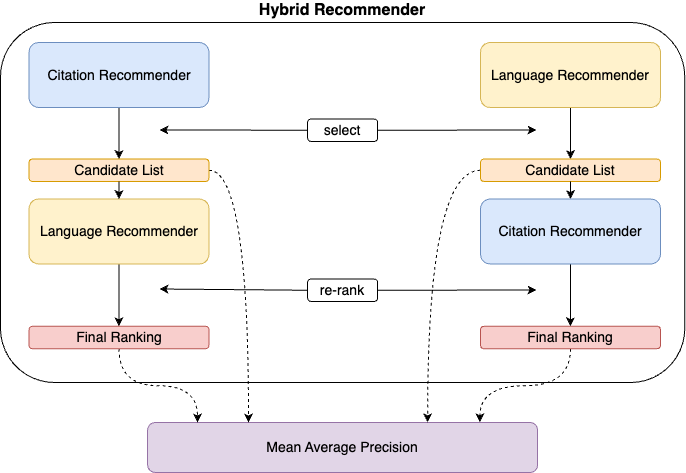
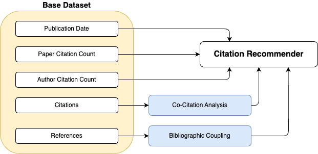
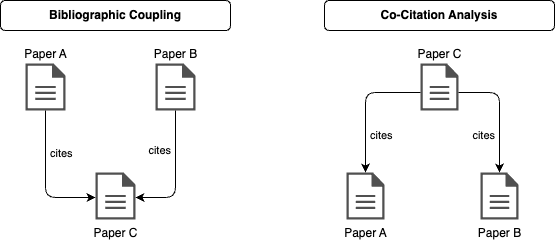
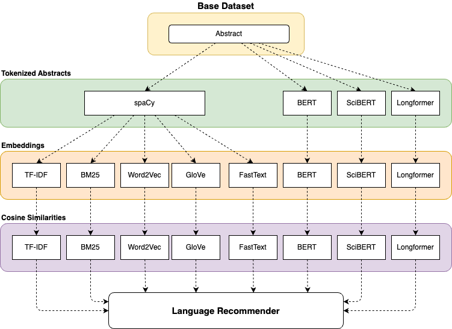

# readnext

[](https://github.com/joel-beck/readnext/actions/workflows/pre-commit.yaml)
[](https://github.com/joel-beck/readnext/actions/workflows/tests.yaml)
[](https://codecov.io/github/joel-beck/readnext)
[](https://pdm.fming.dev)
[](https://joel-beck.github.io/readnext/)
[](https://github.com/joel-beck/readnext)


The `readnext` package provides a hybrid recommender system for computer science papers.
Its main objective is to suggest relevant research papers based on a given query document you might be currently exploring, streamlining your journey to discover more intriguing academic literature.

It is part of my master's thesis, "Bridging Citation Analysis and Language Models: A Hybrid Recommender System for Computer Science Papers", submitted to the University of Göttingen on September 26th, 2023, as a requirement for the Master of Science in Applied Statistics.
The thesis was supervised by [Dr. Corinna Breitinger](https://gipplab.org/team/corinna-breitinger/) and [Dr. Terry Ruas](https://gipplab.org/team/dr-terry-lima-ruas/) from the [Chair for Scientific Information Analytics](https://gipplab.org) at the University of Göttingen.

Find instructions on how to install, setup, and use the `readnext` package with a brief overview of its functionality below.
For more detailed information about usage, customization and reproducibility, check out the [documentation](https://joel-beck.github.io/readnext/).

The motivation, theoretical background and results of this project are presented in the [thesis](https://github.com/joel-beck/msc-thesis/blob/main/thesis/beck-joel_masters-thesis.pdf). The accompanying [repository](https://github.com/joel-beck/msc-thesis) contains the LaTeX source code as well as the code to generate all figures and diagrams in the thesis.


## Quick Links

- **Documentation**: [readnext Docs](https://joel-beck.github.io/readnext/)
- **Thesis**: [Bridging Citation Analysis and Language Models: A Hybrid Recommender System for Computer Science Papers](https://github.com/joel-beck/msc-thesis/blob/main/thesis/beck-joel_masters-thesis.pdf)


## Quick Look

```python
from readnext import readnext, LanguageModelChoice, FeatureWeights

result = readnext(
    # `Attention is all you need` query paper
    arxiv_url="https://arxiv.org/abs/1706.03762",
    language_model_choice=LanguageModelChoice.FASTTEXT,
    feature_weights=FeatureWeights(
        publication_date=1,
        citationcount_document=2,
        citationcount_author=0.5,
        co_citation_analysis=2,
        bibliographic_coupling=2,
    ),
)

print(result.recommendations.language_to_citation.head(8))
```

| candidate_d3_document_id | weighted_points | title                                                                                                           | author            | arxiv_labels                        | integer_label | semanticscholar_url                                                            | arxiv_url                        | publication_date | publication_date_points | citationcount_document | citationcount_document_points | citationcount_author | citationcount_author_points | co_citation_analysis_score | co_citation_analysis_points | bibliographic_coupling_score | bibliographic_coupling_points |
| -----------------------: | --------------: | :-------------------------------------------------------------------------------------------------------------- | :---------------- | :---------------------------------- | ------------: | :----------------------------------------------------------------------------- | :------------------------------- | :--------------- | ----------------------: | ---------------------: | ----------------------------: | -------------------: | --------------------------: | -------------------------: | --------------------------: | ---------------------------: | ----------------------------: |
|                 11212020 |            80.3 | Neural Machine Translation by Jointly Learning to Align and Translate                                           | Yoshua Bengio     | ['cs.CL' 'cs.LG' 'cs.NE' 'stat.ML'] |             1 | https://www.semanticscholar.org/paper/fa72afa9b2cbc8f0d7b05d52548906610ffbb9c5 | https://arxiv.org/abs/1409.0473  | 2014-09-01       |                       0 |                  19996 |                            88 |               372099 |                         100 |                         45 |                          93 |                            4 |                            95 |
|                  7961699 |            70.9 | Sequence to Sequence Learning with Neural Networks                                                              | Ilya Sutskever    | ['cs.CL' 'cs.LG']                   |             1 | https://www.semanticscholar.org/paper/cea967b59209c6be22829699f05b8b1ac4dc092d | https://arxiv.org/abs/1409.3215  | 2014-09-10       |                       0 |                  15342 |                            83 |               234717 |                           0 |                         25 |                          86 |                            5 |                            97 |
|                  1629541 |            58.9 | Fully convolutional networks for semantic segmentation                                                          | Trevor Darrell    | ['cs.CV']                           |             0 | https://www.semanticscholar.org/paper/317aee7fc081f2b137a85c4f20129007fd8e717e | https://arxiv.org/abs/1411.4038  | 2014-11-14       |                       0 |                  25471 |                            91 |               142117 |                           0 |                         20 |                          81 |                            0 |                            49 |
|                206593880 |            57.9 | Rethinking the Inception Architecture for Computer Vision                                                       | Christian Szegedy | ['cs.CV']                           |             0 | https://www.semanticscholar.org/paper/23ffaa0fe06eae05817f527a47ac3291077f9e58 | https://arxiv.org/abs/1512.00567 | 2015-12-02       |                       0 |                  16562 |                            85 |               128072 |                           0 |                         21 |                          83 |                            0 |                            49 |
|                 10716717 |            56.8 | Feature Pyramid Networks for Object Detection                                                                   | Kaiming He        | ['cs.CV']                           |             0 | https://www.semanticscholar.org/paper/b9b4e05faa194e5022edd9eb9dd07e3d675c2b36 | https://arxiv.org/abs/1612.03144 | 2016-12-09       |                       0 |                  10198 |                            70 |               251467 |                           0 |                         14 |                          71 |                            1 |                            72 |
|                  6287870 |            55.7 | TensorFlow: A system for large-scale machine learning                                                           | J. Dean           | ['cs.DC' 'cs.AI']                   |             0 | https://www.semanticscholar.org/paper/46200b99c40e8586c8a0f588488ab6414119fb28 | https://arxiv.org/abs/1605.08695 | 2016-05-27       |                       0 |                  13266 |                            77 |               115104 |                           0 |                          4 |                          33 |                            7 |                            99 |
|                  3429309 |            52.8 | DeepLab: Semantic Image Segmentation with Deep Convolutional Nets, Atrous Convolution, and Fully Connected CRFs | A. Yuille         | ['cs.CV']                           |             0 | https://www.semanticscholar.org/paper/cab372bc3824780cce20d9dd1c22d4df39ed081a | https://arxiv.org/abs/1606.00915 | 2016-06-02       |                       0 |                   9963 |                            69 |                64894 |                           0 |                          9 |                          57 |                            1 |                            72 |
|                  4555207 |            52.8 | MobileNetV2: Inverted Residuals and Linear Bottlenecks                                                          | Liang-Chieh Chen  | ['cs.CV']                           |             0 | https://www.semanticscholar.org/paper/dd9cfe7124c734f5a6fc90227d541d3dbcd72ba4 | https://arxiv.org/abs/1801.04381 | 2018-01-13       |                       0 |                   7925 |                            56 |                39316 |                           0 |                         10 |                          60 |                            2 |                            82 |


See the [Usage](#usage) section for more details and examples.


## Table of Contents <!-- omit from toc -->

- [Quick Links](#quick-links)
- [Quick Look](#quick-look)
- [Installation](#installation)
- [Overview](#overview)
    - [Hybrid Recommender](#hybrid-recommender)
    - [Citation Recommender](#citation-recommender)
    - [Language Recommender](#language-recommender)
    - [Labels](#labels)
    - [Evaluation Metrics](#evaluation-metrics)
- [Setup](#setup)
    - [Data](#data)
    - [Models](#models)
    - [Environment Variables](#environment-variables)
    - [Setup Scripts](#setup-scripts)
- [Usage](#usage)
    - [Examples](#examples)
    - [Input Validation](#input-validation)
- [Evaluation](#evaluation)


## Installation

Currently, the `readnext` package is not available on PyPI but can be installed directly from GitHub.

This project requires Python 3.10.
Earlier versions of Python are not supported.
Future support for higher versions will be available once the `torch` and `transformers` libraries are fully compatible with Python 3.11 and beyond.


```bash
# via HTTPS
pip install git+https://github.com/joel-beck/readnext.git#egg=readnext

# via SSH
pip install git+ssh://git@github.com/joel-beck/readnext.git#egg=readnext
```

If you are interested in customizing the `readnext` package to your own needs, learn about some tips for an efficient development workflow in the [documentation](https://joel-beck.github.io/readnext/setup/#development-workflow).


## Overview

**Note:** This section provides only a surface-level overview of the project.
For a more detailed presentation, see chapter 3 of the [thesis](https://github.com/joel-beck/msc-thesis/blob/main/thesis/beck-joel_masters-thesis.pdf).


### Hybrid Recommender

<p align="center">
  
</p>


The Hybrid Recommender involves a **Citation Recommender** that combines global document characteristics and citation-based features of papers, and a **Language Recommender** that employs a language model to generate embeddings from paper abstracts.

The hybrid recommender combines the Citation Recommender and the Language Recommender in a *cascade* fashion, i.e. one is used to generate a candidate list which is then re-ranked by the other recommender.

The candidate lists and final rankings of both hybrid orderings are evaluated using the Mean Average Precision (MAP) metric. The objectives of the evaluation are:

1. Identify the best feature weights for the Citation Recommender.
1. Identify the best language model for the Language Recommender.
1. Assess whether the hybridization ordering, i.e. if the Citation or the Language Recommender is applied first, influences the Hybrid Recommender's performance.


### Citation Recommender

<p align="center">
  
</p>

The **Citation Recommender** uses three global document features and two citation-based features:

1. **Global Document Features**

    These features are derived from the document metadata:

    - **Publication Date**:
        A *novelty* metric. Recent publications score higher, as they build upon earlier papers and compare their findings with existing results.

    - **Paper Citation Count**:
        A *document popularity* metric. Papers with more citations are, on average and without any prior knowledge, considered more valuable and relevant.

    - **Author Citation Count**:
        An *author popularity* metric. Authors with higher total citations across their publications are deemed more important in the research community.


2. **Citation-Based Features**

    - **Bibliographic Coupling**:
        Counts the number of shared references or shared *cited* papers, i.e. papers that appear in the bibliography of both the query and the candidate paper. Candidate documents with higher bibliographic coupling scores are considered more relevant to the query document.

    - **Co-Citation Analysis**:
        Counts the number of shared citations, which in this context is equivalent to shared *citing papers*. These are papers that themselves cite both the query and the candidate paper. Candidate documents with higher co-citation analysis scores are considered more relevant to the query document.

        <p align="center">
        
        <br>
        <i>
        Left: Bibliographic coupling counts the number of shared references.
        Paper A and Paper B are connected by bibliographic coupling since they both cite the same Paper C.
        Right: Co-citation analysis counts the number of shared citing papers.
        Here, Paper A and Paper B are connected by co-citation analysis since they are both cited by Paper C.
        </i>
        </p>


**Feature Weighting**

The five features of the Citation Recommender are combined linearly with user-specified feature weights. The weights are normalized with the L1 norm, ensuring the results are not affected by the absolute magnitude of the weights.
A caveat of this approach is that the raw feature values, such as the publication date (represented as a date) and the paper citation count (an integer), are not directly comparable.
To aggregate all five features into a single score, a rank-based method is used.

The Citation Recommender first ranks all candidate papers according to each of the five features individually.
The ranking process assigns the top rank 1 to the most relevant candidate paper and increments the rank by 1 for each subsequent paper.
Candidate papers with more recent publication dates, higher citation counts, higher co-citation analysis and higher bibliographic coupling scores receive better rankings.

Finally, those candidate papers with the lowest weighted rank are recommended to the user.

*Note:* The true weighting scheme involves some additional steps that add interpretability but are conceptually equivalent to the version described above. See chapter 3.3 of the [thesis](https://github.com/joel-beck/msc-thesis/blob/main/thesis/beck-joel_masters-thesis.pdf) for more details.


### Language Recommender



The **Language Recommender** encodes paper abstracts into embedding vectors to capture semantic meaning. Candidate papers with embeddings most similar to the query embedding (measured by cosine similarity) are recommended.

8 language models across 3 categories are implemented: keyword-based sparse embedding models, static embedding models, and contextual embedding models.


**Keyword-based models**

They produce sparse vector embeddings where the embedding dimension equals the vocabulary size of all document abstracts in the training corpus.
For these models, text preprocessing and tokenization is performed by the `spaCy` library using the `en_core_web_sm` model.

The following keyword-based models are considered:

- TF-IDF: Implemented with `scikit-learn` [according to the formula](https://scikit-learn.org/stable/modules/feature_extraction.html#tfidf-term-weighting):

    $$\text{TF-IDF}(t, d) = \text{TF}(t, d) \cdot \text{IDF}(t)$$

    with:

    $$\text{TF}(t, d) = \text{count}(t, d)$$

    and:

    $$\text{IDF}(t) = \log\left(\frac{1 + N}{1 + \text{DF}(t)} + 1\right)$$

    where:

    - $t$ is a token,
    - $d$ is a document,
    - $\text{TF}(t, d)$ is the term frequency of token $t$ in document $d$ (interpreted as the relative frequency of a term in a document),
    - $\text{IDF}(t)$ is the inverse document frequency of token $t$ across all documents in the training corpus,
    - $\text{count}(t, d)$ is the count of token $t$ in document $d$,
    - $\text{DF}(t)$ is the document frequency of token $t$ (the number of documents in the corpus that contain the term $t$),
    - $N$ is the total number of documents in the corpus.

    Finally, the TF-IDF vectors are normalized to unit length by the Euclidean norm.

- BM25: Implemented in the BM25+ variant as proposed by (Lv & Zhai, 2011) and described in (Trotman et al., 2014).

    The formula is:

    $$\text{BM25}(t, d) = \text{BM25-TF}(t, d) \cdot \text{BM25-IDF}(t)$$

    with:

    $$\text{BM25-TF}(t, d) = \frac{(k + 1) \cdot \text{TF}(t, d)}{k \cdot (1 - b + b \cdot (\text{len}(d) / \text{avgdl})) + \text{TF}(t, d)} + \delta$$

    and:

    $$\text{BM25-IDF}(t) = \log\left(\frac{N+1}{\text{DF}(t)}\right)$$

    where:

    - $t$ is a token,
    - $d$ is a document,
    - $\text{BM25-TF}(t, d)$ is the BM25+ term frequency of token $t$ in document $d$,
    - $\text{BM25-IDF}(t)$ is the BM25+ inverse document frequency of token $t$ across all documents in the training corpus,
    - $\text{TF}(t, d)$ is the term frequency of token $t$ in document $d$ (interpreted as the relative frequency of a term in a document),
    - $\text{DF}(t)$ is the document frequency of token $t$ (the number of documents in the corpus that contain the term $t$),
    - $\text{len}(d)$ is the total number of tokens in document $d$,
    - $\text{avgdl}$ is the average document length across the corpus,
    - $N$ is the total number of documents in the corpus,
    - $k$, $b$, and $\delta$ are free parameters.

    Default values of $k = 1.5$, $b = 0.75$, and $\delta = 1.0$ are adapted from the [rank_bm25 package](https://github.com/dorianbrown/rank_bm25/blob/990470ebbe6b28c18216fd1a8b18fe7446237dd6/rank_bm25.py#L176).


**Static embedding models**

They produce dense vector embeddings where the embedding dimension is fixed (here set to the default of 300) and independent of the vocabulary size.
Word embeddings are averaged dimension-wise to obtain a single embedding vector for each abstract.
Again, `spaCy` is used for text preprocessing and tokenization.
All three static embedding models are pretrained and implemented via their `gensim` interface:

- Word2Vec: Pretrained on the Google News corpus using the `word2vec-google-news-300` gensim model.
- GloVe: Pretrained on the Gigaword corpus and Wikipedia using the `glove.6B.300d` model from the NLP Stanford GloVe project.
- FastText: Pretrained on the Common Crawl corpus and Wikipedia using the `cc.en.300.bin` model from the FastText Website.


**Contextual embedding models**

Similar to static embedding models, they produce dense vector embeddings where the embedding dimension is fixed (here set to the default of 768) and independent of the vocabulary size.
Instead of string tokens, contextual embedding models take integer token IDs as input which are mapped to words and subwords and learned during pretraining.
All three static embedding models are pretrained and implemented via the HuggingFace `transformers` library:

- BERT: Pretrained on the BooksCorpus and English Wikipedia using the `bert-base-uncased` model.
- SciBERT: Pretrained on the Semantic Scholar corpus (i.e. specific to scientific language) using the `allenai/scibert_scivocab_uncased` model.
- Longformer: Pretrained on the BooksCorpus and English Wikipedia using the `allenai/longformer-base-4096` model.

Instead of averaging word embeddings like static embedding models, these Transformer based models cut off the document abstracts at a maximum token length of 512 for BERT and SciBERT and 4096 for the Longformer model.
However, only 0.58% of all abstracts in the training corpus exceed the maximum token length of 512 such that the impact of this cutoff is negligible.


### Labels

To determine whether the Hybrid Recommender generates relevant or irrelevant recommendations, **arXiV categories** are used as labels.
Within the Computer Science domain there are 40 different arXiV categories, such as `cs.AI` for Artificial Intelligence or `cs.CL` for Computation and Language.
Importantly, each paper is not constrained to a single category but can be assigned to multiple categories.

Based on these labels, a binary classification task is defined: A candidate paper is considered a *relevant* recommendation if it shares at least one arXiV label with the query paper, and *irrelevant* otherwise.
For instance, if the query paper is assigned to the `cs.CL` and `cs.IR` categories, the candidate paper *BERT: Pre-training of Deep Bidirectional Transformers for Language Understanding* by Devlin et al. (2018) is considered a relevant recommendation because it is assigned to the `cs.CL` category. Hence, there is an overlap between the query and candidate paper's arXiV labels.
In contrast, the candidate paper *Deep Residual Learning for Image Recognition* by He et al. (2016) is considered an irrelevant recommendation because it is only assigned to the `cs.CV` category, which does not overlap with any of the query paper's categories.


### Evaluation Metrics

The **Mean Average Precision (MAP)** is used as the primary evaluation metric to assess the performance of the Hybrid Recommender.

Although many evaluation metrics are available for recommender systems, the MAP is chosen due to the following reasons:

1. It takes the order of recommendations into account, i.e. it is not only important to recommend relevant items but also to recommend them early in the list.
1. All items on the recommendation list are considered, i.e. it is not only important to recommend relevant items but also to avoid irrelevant items.
1. It works well with binary 0/1 encoded labels as in our case for irrelevant/relevant recommendations.

The **Average Precision (AP)** computes a scalar score for a single recommendation list according to the following definitions:

**Precision**

$$\text{Precision} = \frac{\text{number of relevant items}}{\text{number of items}}$$


**Average Precision (AP)**

$$\text{AP} = \frac{1}{r} \sum_{k=1}^{K} P(k) \cdot \text{rel}(k)$$

where:

- $K$ is the total number of items,
- $r$ is the total number of relevant items,
- $P(k)$ is the precision at $k$,
- $\text{rel}(k)$ is 1 if item $k$ is relevant and 0 otherwise.

If the labels are binary 0/1 encoded as in our case, the formula simplifies to:

$$\text{AP} = \frac{1}{r} \sum_{k=1}^{K} \frac{\sum_{i=1}^{k} \text{rel}(i)}{k}$$


The Mean Average Precision is then computed as the average over the Average Precision scores for the recommendations of all query documents in the training corpus.

**Mean Average Precision (MAP)**

$$\text{MAP} = \frac{1}{Q} \sum_{q=1}^{Q} \text{AP}(q)$$

where:

- $Q$ is the total number of query documents,
- $\text{AP}(q)$ is the average precision for query document $q$.

Within this project, the MAP computes a scalar score for a given combination of Language Model Choice and Feature Weights.
Thus, to determine which Recommender order works best within the Hybrid structure, we could e.g. aggregate the MAP scores for each order over all Language Model Choices and Feature Weights.


**Example**

The recommendation list [relevant, irrelvant, relevant] has a Precision of $P = \frac{2}{3}$ and an Average Precision of $AP = \frac{1}{2} \cdot (\frac{1}{1} + \frac{2}{3}) = \frac{5}{6}$.

The recommendation list [relevant, relevant, irrelevant] has a Precision of $P = \frac{2}{3}$ and an Average Precision of $AP = \frac{1}{2} \cdot (\frac{1}{1} + \frac{2}{2}) = 1$.

The MAP of these two rankings is $MAP = \frac{1}{2} \cdot (\frac{5}{6} + 1) = \frac{11}{12}$.


## Setup

To execute all scripts and reproduce project results, some **local downloads** are necessary as prerequisites, including data files and pretrained models.

### Data


There are three data sources for this project:

1. **D3 Dataset**

    The [D3 DBLP Discovery Dataset](https://github.com/jpwahle/lrec22-d3-dataset/tree/main) is a compilation of metadata for over 6 million computer science papers. It is the primary data source for this project. All three global document features as well as the paper abstracts are provided by this dataset.

    The dataset consists of two files with information about documents and authors, respectively. They can be downloaded from the [Zenodo repository](https://zenodo.org/record/7071698#.ZFZnCi9ByLc).

2. **Arxiv Labels**

    Arxiv categories are used as labels for evaluating the Hybrid Recommender's performance.
    A binary classification task is defined: A candidate paper is considered a *relevant* recommendation if it shares at least one arXiV label with the query paper, and *irrelevant* otherwise.
    Arxiv labels are extracted from the [arxiv-metadata-oai-snapshot.json](https://www.kaggle.com/datasets/Cornell-University/arxiv) dataset on Kaggle.

3. **Citation Information**

    To obtain individual citations and references to compute co-citation analysis and bibliographic coupling scores, the [Semantic Scholar API](https://api.semanticscholar.org/api-docs/graph) is fetched.
    A [private API key](https://www.semanticscholar.org/product/api#api-key) is recommended for a higher request rate.


### Models

The following pretrained Word2Vec, GloVe, and FastText models are used as static embedding models:

- Pretrained [word2vec-google-news-300 Word2Vec model](https://github.com/RaRe-Technologies/gensim-data) from Gensim
- Pretrained [glove.6B GloVe model](https://nlp.stanford.edu/projects/glove/) from the Stanford NLP website
- Pretrained [English FastText model](https://fasttext.cc/docs/en/crawl-vectors.html#models) from the FastText website


### Environment Variables

`readnext` needs to know the locations of local data and model files in your file system, which can be stored in any directory.
User-specific information is provided through environment variables.
The `.env_template` file in the project root directory contains a template for the expected environment variables with default values (except for the Semantic Scholar API key):

```bash
# .env_template
DOCUMENTS_METADATA_FILENAME="2022-11-30_papers.jsonl"
AUTHORS_METADATA_FILENAME="2022-11-30_authors.jsonl"
ARXIV_METADATA_FILENAME="arxiv_metadata.json"

SEMANTICSCHOLAR_API_KEY="ABC123"

DATA_DIRPATH="data"
MODELS_DIRPATH="models"
RESULTS_DIRPATH="results"
```

Explanation of the environment variables:

-  `DOCUMENTS_METADATA_FILENAME` and `AUTHORS_METADATA_FILENAME` correspond to the downloaded D3 dataset files, `ARXIV_METADATA_FILENAME` to the downloaded arxiv dataset file.
-  `SEMANTICSCHOLAR_API_KEY` represents the API key for the Semantic Scholar API.
-  `DATA_DIRPATH` is the directory path for all local data files, including downloaded and generated data files.
-  `MODELS_DIRPATH` is the directory path for all pretrained model files.
-  `RESULTS_DIRPATH` is the directory path for all stored result files, such as tokenized abstracts, numeric embeddings of abstracts, and precomputed co-citation analysis, bibliographic coupling, and cosine similarity scores.


### Setup Scripts

The inference step of the `readnext` package leverages preprocessed and precomputed data such that all recommender features and abstract embeddings are readily available.
To generate these files locally, run the following setup scripts in the specified order.
All scripts are located in the `readnext/scripts` directory.


1. **Dataset Construction**

    These scripts are located in the `readnext/scripts/data` directory.

    1. `s1_read_raw_data.py`: Reads documents, authors and arxiv metadata from raw JSON files and write it out into Parquet format.
    1. `s2_merge_arxiv_labels.py`: Merges the arxiv metadata with the D3 dataset via the arxiv id. Adds arxiv labels as new feature to the dataset which are later used as ground-truth labels for the recommender system.
    1. `s3_merge_authors.py`: Adds the author citationcount to the dataset and selects the most popular author for each document.
    1. `s4_add_citations.py`: Sends requests to the semanticscholar API to obtain citation and reference urls for all documents in the dataset and add them as features to the dataframe.
    1. `s5_add_ranks.py`: Adds rank features for global document characteristics (publication date, document citation count and author citation count) to the dataset and selects a subset of the most cited documents for the final dataset.


All further script paths are relative to the `readnext/scripts/modeling` directory.


2. **Citation Models**

    1. `run_co_citation_analysis.py`: Precomputes co-citation analysis scores for all document pairs in the dataset.
    1. `bibliographic_coupling.py`: Precomputes bibliographic coupling scores for all document pairs in the dataset.


3. **Language Models**

    1. `tokenizer/run_tokenizer.py`: Tokenizes the abstracts of all documents in the dataset by four different tokenizers into the appropriate format for all eight language models.
    1. `embedder/run_embedder_*.py`: These scripts generate sparse or dense numeric embeddings of all document abstracts for each language model. The process is split into separate scripts for each model to allow for easy parallelization.
    1. `cosine_similarities/run_cosine_similarities_*.py`: Precomputes cosine similarity scores for all document pairs in the dataset for each language model. Again, multiple scripts are used for parallelization purposes.

    Note that the `run_embedder_*.py` and `run_cosine_similarities_*.py` scripts are independent between different language models!
    That means that you can run a subset of scripts only for those language models that you want to use for the recommender system.
    For example, if you are only interested in the Longformer language model, it is sufficient to run the scripts `run_embedder_longformer.py` and `run_cosine_similarities_longformer.py` in steps ii. and iii., respectively.


## Usage

The user interface for generating recommendations is designed to be simple and easy to use.
It relies on the top-level `readnext()` function, which takes two required and one optional keyword argument:

- An identifier for the query paper.
This can be the Semanticscholar ID, Semanticscholar URL, Arxiv ID, or Arxiv URL of the paper.
This argument is required and should be provided as a string.

    **Term Definition**:

    - The *Semanticscholar ID* is a 40-digit hexadecimal string at the end of the Semanticscholar URL after the last forward slash.
    For example, the Semanticscholar ID for the URL `https://www.semanticscholar.org/paper/67c4ffa7f9c25e9e0f0b0eac5619070f6a5d143d` is `67c4ffa7f9c25e9e0f0b0eac5619070f6a5d143d`.
    - The *Arxiv ID* is a 4-digit number followed by a dot followed by a 5-digit number at the end of the Arxiv URL after the last forward slash.
    For example, the Arxiv ID for the URL `https://arxiv.org/abs/1234.56789` is `1234.56789`.

- The language model choice for the Language Recommender, which is used to tokenize and embed the query paper's abstract.
This argument is required and should be passed using the `LanguageModelChoice` Enum, which provides autocompletion for all eight available language models.

- The feature weighting for the Citation Recommender.
This argument is optional and is submitted using an instance of the `FeatureWeights` class.
If not specified, the five features (`publication_date`, `citationcount_document`, `citationcount_author`, `co_citation_analysis`, and `bibliographic_coupling`) are given equal weights of one.
Note that the weights are normalized to sum up to one, so the absolute values are irrelevant; only the relative ratios matter.


### Examples

Inference works for both 'seen' and 'unseen' query documents, depending on whether the query document is part of the training corpus or not.


**Seen Query Paper**

If the query paper is part of the training corpus, all feature values are precomputed and inference is fast.

In the [Quick Look](#quick-look) example at the beginning, we have already obtained recommendations for the query paper "Attention is all you need" by Vaswani et al. (2017) using the `FastText` language model and custom feature weights.

Assuming we have read the top recommendation "Neural Machine Translation by Jointly Learning to Align and Translate" by Yoshua Bengio, we can continue our reading flow by extracting the identifier for the previously recommended paper from the `semantischolar_url` or `arxiv_url` columns of the previous output.
In this case, we use the `SciBERT` language model and the default feature weights of 1 for each feature:

```python
from readnext import readnext, LanguageModelChoice, FeatureWeights

result = readnext(
    # `Attention is all you need` query paper
    arxiv_url="https://arxiv.org/abs/1706.03762",
    language_model_choice=LanguageModelChoice.FASTTEXT,
    feature_weights=FeatureWeights(
        publication_date=1,
        citationcount_document=2,
        citationcount_author=0.5,
        co_citation_analysis=2,
        bibliographic_coupling=2,
    ),
)

# extract one of the paper identifiers from the previous top recommendation
semanticscholar_url = result.recommendations.citation_to_language[0, "semanticscholar_url"]

result_seen_query = readnext(
    semanticscholar_url=semanticscholar_url,
    language_model_choice=LanguageModelChoice.SCIBERT,
)
```

A message is printed to the console indicating that the query paper is part of the training corpus:

```console
> ╭──────────────────────────────────────────────────╮
> │                                                  │
> │ Query document is contained in the training data │
> │                                                  │
> ╰──────────────────────────────────────────────────╯
```

The return value of the `readnext()` function contains the following attributes:

- `document_identifier`: Contains the identifiers of the query paper.

- `document_info`: Provides information about the query paper.

- `features`: Individual dataframes that include values for `publication_date`, `citationcount_document`, `citationcount_author`, `co_citation_analysis`, `bibliographic_coupling`, `cosine_similarity`, and `feature_weights`.

- `ranks`: Individual dataframes that list the ranks of individual features.

- `points`: Individual dataframes that specify the points of individual features.

- `labels`: Individual dataframes that present the arxiv labels for all candidate papers and binary 0/1 labels related to the query paper.
These binary labels are useful for 'seen' query papers where the arxiv labels of the query paper is known.
For 'unseen' papers this information is not availabels and all binary labels are set to 0.

- `recommendations`: Individual dataframes that offer the top paper recommendations.
Recommendations are calculated for both Hybrid-Recommender orders (Citation -> Language and Language -> Citation) and both the intermediate candidate lists and the final hybrid recommendations.

Let's first take a look at our new query paper:

```python
print(result_seen_query.document_info)
```

```console
> Document 11212020
> ---------------------
> Title: Neural Machine Translation by Jointly Learning to Align and Translate
> Author: Yoshua Bengio
> Publication Date: 2014-09-01
> Arxiv Labels: ['cs.CL', 'cs.LG', 'cs.NE', 'stat.ML']
> Semanticscholar URL: https://www.semanticscholar.org/paper/fa72afa9b2cbc8f0d7b05d52548906610ffbb9c5
> Arxiv URL: https://arxiv.org/abs/1409.0473
```

Now we want to get recommendations for which papers we should read next.
Here, we choose the recommendations for the Citation -> Language Hybrid-Recommender order.

The output is a dataframe where each row represents a recommendation.
The rows are sorted in descending order by the cosine similarity between the query paper and the candidate papers since the re-ranking step is performed by the Language Recommender.

For brevity we limit the output to the top three recommendations:


```python
print(result_seen_query.recommendations.citation_to_language.head(3))
```

| candidate_d3_document_id | cosine_similarity | title                                                                                         | author                 | publication_date | arxiv_labels                        | integer_label | semanticscholar_url                                                            | arxiv_url                        |
| -----------------------: | ----------------: | :-------------------------------------------------------------------------------------------- | :--------------------- | :--------------- | :---------------------------------- | ------------: | :----------------------------------------------------------------------------- | :------------------------------- |
|                  7961699 |             0.959 | Sequence to Sequence Learning with Neural Networks                                            | Ilya Sutskever         | 2014-09-10       | ['cs.CL' 'cs.LG']                   |             1 | https://www.semanticscholar.org/paper/cea967b59209c6be22829699f05b8b1ac4dc092d | https://arxiv.org/abs/1409.3215  |
|                  5590763 |            0.9537 | Learning Phrase Representations using RNN Encoder–Decoder for Statistical Machine Translation | Yoshua Bengio          | 2014-06-03       | ['cs.CL' 'cs.LG' 'cs.NE' 'stat.ML'] |             1 | https://www.semanticscholar.org/paper/0b544dfe355a5070b60986319a3f51fb45d1348e | https://arxiv.org/abs/1406.1078  |
|                  1998416 |            0.9467 | Effective Approaches to Attention-based Neural Machine Translation                            | Christopher D. Manning | 2015-08-17       | ['cs.CL']                           |             1 | https://www.semanticscholar.org/paper/93499a7c7f699b6630a86fad964536f9423bb6d0 | https://arxiv.org/abs/1508.04025 |


Hence, we might read the paper "Sequence to Sequence Learning with Neural Networks" by Ilya Sutskever et al. next.

If you are interested in the additional Citation Recommender feature values that were used to generate the candidate list, you can access them via the `recommendations.citation_to_language_candidates` attribute of the `result_seen_query` object.


**Unseen Query Paper**

If the query paper is not part of the training corpus, the inference step takes longer since tokenization, embedding and the computation of co-citation analysis, bibliographic coupling and cosine similarity scores has to be performed from scratch.

However, apart from a longer waiting time, **the user does not have to care about** if the query paper is part of the training corpus or not since the user interface remains the same!

As an example, we fetch recommendations for the "GPT-4 Technical Report" paper by OpenAI. This paper is too recent to be part of the training corpus.

Due to its recency, it might not have been cited that often, so we lower the weight of the `co_citation_analysis` feature. Further, we increase the `publication_date` weight and decrease the `citationcount_author` weight.
For the Language Recommender we use the `GloVe` model to embed the paper abstract.

Note that we only need to specify the weights for the features we want to change from the default value of 1

```python
from readnext import readnext, LanguageModelChoice, FeatureWeights

result_unseen_query = readnext(
    arxiv_url="https://arxiv.org/abs/2303.08774",
    language_model_choice=LanguageModelChoice.GLOVE,
    feature_weights=FeatureWeights(
        publication_date=4,
        citationcount_author=0.2,
        co_citation_analysis=0.2,
    ),
)
```

The console output informs us that the query paper is not part of the training corpus and provides some progress updates for the ongoing computations:

```console
> ╭──────────────────────────────────────────────────────╮
> │                                                      │
> │ Query document is not contained in the training data │
> │                                                      │
> ╰──────────────────────────────────────────────────────╯

> Loading training corpus................. ✅ (0.07 seconds)
> Tokenizing query abstract............... ✅ (0.41 seconds)
> Loading pretrained Glove model.......... ✅ (26.38 seconds)
> Embedding query abstract................ ✅ (0.00 seconds)
> Loading pretrained embeddings........... ✅ (0.19 seconds)
> Computing cosine similarities........... ✅ (0.05 seconds)
```

The time distribution differs between the language models. For `GloVe`, loading the large pretrained model into memory allocates by far the most time.

Now, we generate the recommendations candidate list with the Language Recommender and re-rank the candidates with the Citation Recommender.
Since the second recommender of the hybrid structure is the Citation Recommender, the output is sorted by the weighted points score of the individual features:

```python
print(result_unseen_query.recommendations.language_to_citation.head(3))
```

| candidate_d3_document_id | weighted_points | title                                                            | author          | arxiv_labels      | integer_label | semanticscholar_url                                                            | arxiv_url                        | publication_date | publication_date_points | citationcount_document | citationcount_document_points | citationcount_author | citationcount_author_points | co_citation_analysis_score | co_citation_analysis_points | bibliographic_coupling_score | bibliographic_coupling_points |
| -----------------------: | --------------: | :--------------------------------------------------------------- | :-------------- | :---------------- | ------------: | :----------------------------------------------------------------------------- | :------------------------------- | :--------------- | ----------------------: | ---------------------: | ----------------------------: | -------------------: | --------------------------: | -------------------------: | --------------------------: | ---------------------------: | ----------------------------: |
|                247951931 |              80 | PaLM: Scaling Language Modeling with Pathways                    | Noam M. Shazeer | ['cs.CL']         |             0 | https://www.semanticscholar.org/paper/094ff971d6a8b8ff870946c9b3ce5aa173617bfb | https://arxiv.org/abs/2204.02311 | 2022-04-05       |                      99 |                    145 |                             0 |                51316 |                           0 |                         72 |                          99 |                           77 |                            96 |
|                230435736 |            14.6 | The Pile: An 800GB Dataset of Diverse Text for Language Modeling | Jason Phang     | ['cs.CL']         |             0 | https://www.semanticscholar.org/paper/db1afe3b3cd4cd90e41fbba65d3075dd5aebb61e | https://arxiv.org/abs/2101.00027 | 2020-12-31       |                      19 |                    154 |                             0 |                 1303 |                           0 |                         17 |                          86 |                           48 |                             0 |
|                227239228 |            13.3 | Pre-Trained Image Processing Transformer                         | W. Gao          | ['cs.CV' 'cs.LG'] |             0 | https://www.semanticscholar.org/paper/43cb4886a8056d5005702edbc51be327542b2124 | https://arxiv.org/abs/2012.00364 | 2020-12-01       |                       5 |                    379 |                             0 |                13361 |                           0 |                          1 |                           0 |                           52 |                            65 |


The top recommendation introducing the PaLM language model as a competitor to the GPT family seems quite reasonable.

Note that the `integer_label` column is not informative for unseen query papers and only kept for consistency.
Since no arxiv labels are available for unseen query papers they can not intersect with the arxiv labels of the candidates such that all values of the `integer_label` column are set to 0.


If you are interested in the cosine similarity values that were used to generate the candidate list, you can access them via the `recommendations.language_to_citation_candidates` attribute of the `result_unseen_query` object.


### Input Validation

The `pydantic` library is used for basic input validation.
For invalid user inputs the command fails early before any computations are performed with an informative error message.

The following checks are performed:

- The Semanticscholar ID must be a 40-character hexadecimal string.

- The Semanticscholar URL must be a valid URL starting with `https://www.semanticscholar.org/paper/`.

- The Arxiv ID must start with 4 digits followed by a dot followed by 5 more
digits (e.g. `1234.56789`).

- The Arxiv URL must be a valid URL starting with `https://arxiv.org/abs/`.

- At least one of the four query paper identifiers must be provided.

- The feature weights must be non-negative numeric values.


For example, the following command fails because we assigned a negative weight to the `publication_date` feature:

```python
from readnext import readnext, LanguageModelChoice, FeatureWeights

result = readnext(
    arxiv_id="2101.03041",
    language_model_choice=LanguageModelChoice.BM25,
    feature_weights=FeatureWeights(publication_date=-1),
)
```

```console
pydantic.error_wrappers.ValidationError: 1 validation error for FeatureWeights
publication_date
  ensure this value is greater than or equal to 0 (type=value_error.number.not_ge; limit_value=0)
```


## Evaluation

The evaluation strategy and results are described in detail in chapter 4 of the [thesis](https://github.com/joel-beck/msc-thesis/blob/main/thesis/beck-joel_masters-thesis.pdf).

The main findings are:

1. The Bibliographic Coupling feature is the most important feature for the Citation Recommender followed by the Co-Citation Analysis feature. The Paper Citation Count performs worst and is, on average, equally effective as randomly chosen papers from the training corpus.

1. The SciBERT language model performs best for the Language Recommender followed by TF-IDF and BERT. The Longformer model cannot leverage its strength on long documents and performs worst.

1. When using only a single recommender, the Language Recommender outperforms the Citation Recommender.

1. The best hybrid model is the Language -> Citation Hybrid Recommender, i.e. using the Language Recommender first for candidate selection and the Citation Recommender second for re-ranking.

1. Surprisingly, the best overall model is *not* a hybrid model, but rather the Language Recommender with the SciBERT language model alone.
