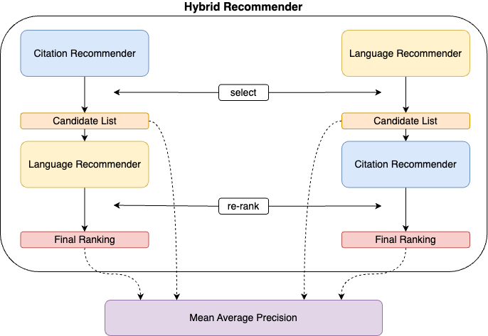
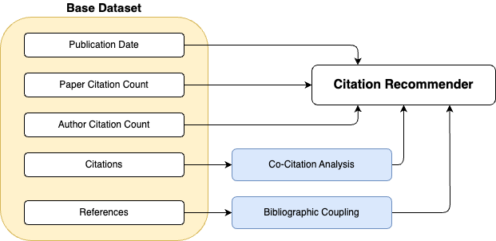

# Overview

**Note:** This section provides only a surface-level overview of the project.
For a more detailed presentation, see chapter 3 of the [thesis](https://github.com/joel-beck/msc-thesis/blob/main/thesis/beck-joel_masters-thesis.pdf).

## Hybrid Recommender

The Hybrid Recommender involves a **Citation Recommender** that combines global document characteristics and citation-based features of papers, and a **Language Recommender** that employs a language model to generate embeddings from paper abstracts.

The hybrid recommender combines the Citation Recommender and the Language Recommender in a *cascade* fashion, i.e. one is used to generate a candidate list which is then re-ranked by the other recommender.

The candidate lists and final rankings of both hybrid orderings are evaluated using the Mean Average Precision (MAP) metric. The objectives of the evaluation are:

1. Identify the best feature weights for the Citation Recommender.
1. Identify the best language model for the Language Recommender.
1. Assess whether the hybridization ordering, i.e. if the Citation or the Language Recommender is applied first, influences the Hybrid Recommender's performance.

## Citation Recommender

The **Citation Recommender** uses three global document features and two citation-based features:

1. **Global Document Features**

    These features are derived from the document metadata:

    - **Publication Date**:
        A *novelty* metric. Recent publications score higher, as they build upon earlier papers and compare their findings with existing results.

    - **Paper Citation Count**:
        A *document popularity* metric. Papers with more citations are, on average and without any prior knowledge, considered more valuable and relevant.

    - **Author Citation Count**:
        An *author popularity* metric. Authors with higher total citations across their publications are deemed more important in the research community.

2. **Citation-Based Features**

    

    - **Co-Citation Analysis**:
        Counts the number of shared citations, which in this context is equivalent to shared *citing papers*. These are papers that themselves cite both the query and the candidate paper. Candidate documents with higher co-citation analysis scores are considered more relevant to the query document.

    - **Bibliographic Coupling**:
        Counts the number of shared references or shared *cited* papers, i.e. papers that appear in the bibliography of both the query and the candidate paper. Candidate documents with higher bibliographic coupling scores are considered more relevant to the query document.

**Feature Weighting**

The five features of the Citation Recommender are combined linearly with user-specified feature weights. The weights are normalized with the L1 norm, ensuring the results are not affected by the absolute magnitude of the weights.
A caveat of this approach is that the raw feature values, such as the publication date (represented as a date) and the paper citation count (an integer), are not directly comparable.
To aggregate all five features into a single score, a rank-based method is used.

The Citation Recommender first ranks all candidate papers according to each of the five features individually.
The ranking process assigns the top rank 1 to the most relevant candidate paper and increments the rank by 1 for each subsequent paper.
Candidate papers with more recent publication dates, higher citation counts, higher co-citation analysis and higher bibliographic coupling scores receive better rankings.

Finally, those candidate papers with the lowest weighted rank are recommended to the user.

*Note:* The true weighting scheme involves some additional steps that add interpretability but are conceptually equivalent to the version described above. See chapter 3.3 of the [thesis](https://github.com/joel-beck/msc-thesis/blob/main/thesis/beck-joel_masters-thesis.pdf) for more details.

## Language Recommender

The **Language Recommender** encodes paper abstracts into embedding vectors to capture semantic meaning. Candidate papers with embeddings most similar to the query embedding (measured by cosine similarity) are recommended.

8 language models across 3 categories are implemented: keyword-based sparse embedding models, static embedding models, and contextual embedding models.

**Keyword-based models**

They produce sparse vector embeddings where the embedding dimension equals the vocabulary size of all document abstracts in the training corpus.
For these models, text preprocessing and tokenization is performed by the `spaCy` library using the `en_core_web_sm` model.

The following keyword-based models are considered:

- TF-IDF: Implemented with `scikit-learn` [according to the formula](https://scikit-learn.org/stable/modules/feature_extraction.html#tfidf-term-weighting):

    $$\text{TF-IDF}(t, d) = \text{TF}(t, d) \cdot \text{IDF}(t)$$

    with:

    $$\text{TF}(t, d) = \text{count}(t, d)$$

    and:

    $$\text{IDF}(t) = \log\left(\frac{1 + N}{1 + \text{DF}(t)} + 1\right)$$

    where:

    - $t$ is a token,
    - $d$ is a document,
    - $\text{TF}(t, d)$ is the term frequency of token $t$ in document $d$ (interpreted as the relative frequency of a term in a document),
    - $\text{IDF}(t)$ is the inverse document frequency of token $t$ across all documents in the training corpus,
    - $\text{count}(t, d)$ is the count of token $t$ in document $d$,
    - $\text{DF}(t)$ is the document frequency of token $t$ (the number of documents in the corpus that contain the term $t$),
    - $N$ is the total number of documents in the corpus.

    Finally, the TF-IDF vectors are normalized to unit length by the Euclidean norm.

- BM25: Implemented in the BM25+ variant as proposed by (Lv & Zhai, 2011) and described in (Trotman et al., 2014).

    The formula is:

    $$\text{BM25}(t, d) = \text{BM25-TF}(t, d) \cdot \text{BM25-IDF}(t)$$

    with:

    $$\text{BM25-TF}(t, d) = \frac{(k + 1) \cdot \text{TF}(t, d)}{k \cdot (1 - b + b \cdot (\text{len}(d) / \text{avgdl})) + \text{TF}(t, d)} + \delta$$

    and:

    $$\text{BM25-IDF}(t) = \log\left(\frac{N+1}{\text{DF}(t)}\right)$$

    where:

    - $t$ is a token,
    - $d$ is a document,
    - $\text{BM25-TF}(t, d)$ is the BM25+ term frequency of token $t$ in document $d$,
    - $\text{BM25-IDF}(t)$ is the BM25+ inverse document frequency of token $t$ across all documents in the training corpus,
    - $\text{TF}(t, d)$ is the term frequency of token $t$ in document $d$ (interpreted as the relative frequency of a term in a document),
    - $\text{DF}(t)$ is the document frequency of token $t$ (the number of documents in the corpus that contain the term $t$),
    - $\text{len}(d)$ is the total number of tokens in document $d$,
    - $\text{avgdl}$ is the average document length across the corpus,
    - $N$ is the total number of documents in the corpus,
    - $k$, $b$, and $\delta$ are free parameters.

    Default values of $k = 1.5$, $b = 0.75$, and $\delta = 1.0$ are adapted from the [rank_bm25 package](https://github.com/dorianbrown/rank_bm25/blob/990470ebbe6b28c18216fd1a8b18fe7446237dd6/rank_bm25.py#L176).

**Static embedding models**

They produce dense vector embeddings where the embedding dimension is fixed (here set to the default of 300) and independent of the vocabulary size.
Word embeddings are averaged dimension-wise to obtain a single embedding vector for each abstract.
Again, `spaCy` is used for text preprocessing and tokenization.
All three static embedding models are pretrained and implemented via their `gensim` interface:

- Word2Vec: Pretrained on the Google News corpus using the `word2vec-google-news-300` gensim model.
- GloVe: Pretrained on the Gigaword corpus and Wikipedia using the `glove.6B.300d` model from the NLP Stanford GloVe project.
- FastText: Pretrained on the Common Crawl corpus and Wikipedia using the `cc.en.300.bin` model from the FastText Website.

**Contextual embedding models**

Similar to static embedding models, they produce dense vector embeddings where the embedding dimension is fixed (here set to the default of 768) and independent of the vocabulary size.
Instead of string tokens, contextual embedding models take integer token IDs as input which are mapped to words and subwords and learned during pretraining.
All three static embedding models are pretrained and implemented via the HuggingFace `transformers` library:

- BERT: Pretrained on the BooksCorpus and English Wikipedia using the `bert-base-uncased` model.
- SciBERT: Pretrained on the Semantic Scholar corpus (i.e. specific to scientific language) using the `allenai/scibert_scivocab_uncased` model.
- Longformer: Pretrained on the BooksCorpus and English Wikipedia using the `allenai/longformer-base-4096` model.

Instead of averaging word embeddings like static embedding models, these Transformer based models cut off the document abstracts at a maximum token length of 512 for BERT and SciBERT and 4096 for the Longformer model.
However, only 0.58% of all abstracts in the training corpus exceed the maximum token length of 512 such that the impact of this cutoff is negligible.

## Labels

To determine whether the Hybrid Recommender generates relevant or irrelevant recommendations, **arXiV categories** are used as labels.
Within the Computer Science domain there are 40 different arXiV categories, such as `cs.AI` for Artificial Intelligence or `cs.CL` for Computation and Language.
Importantly, each paper is not constrained to a single category but can be assigned to multiple categories.

Based on these labels, a binary classification task is defined: A candidate paper is considered a *relevant* recommendation if it shares at least one arXiV label with the query paper, and *irrelevant* otherwise.
For instance, if the query paper is assigned to the `cs.CL` and `cs.IR` categories, the candidate paper *BERT: Pre-training of Deep Bidirectional Transformers for Language Understanding* by Devlin et al. (2018) is considered a relevant recommendation because it is assigned to the `cs.CL` category. Hence, there is an overlap between the query and candidate paper's arXiV labels.
In contrast, the candidate paper *Deep Residual Learning for Image Recognition* by He et al. (2016) is considered an irrelevant recommendation because it is only assigned to the `cs.CV` category, which does not overlap with any of the query paper's categories.

## Evaluation Metrics

The **Mean Average Precision (MAP)** is used as the primary evaluation metric to assess the performance of the Hybrid Recommender.

Although many evaluation metrics are available for recommender systems, the MAP is chosen due to the following reasons:

1. It takes the order of recommendations into account, i.e. it is not only important to recommend relevant items but also to recommend them early in the list.
1. All items on the recommendation list are considered, i.e. it is not only important to recommend relevant items but also to avoid irrelevant items.
1. It works well with binary 0/1 encoded labels as in our case for irrelevant/relevant recommendations.

The **Average Precision (AP)** computes a scalar score for a single recommendation list according to the following definitions:

**Precision**

$$\text{Precision} = \frac{\text{number of relevant items}}{\text{number of items}}$$

**Average Precision (AP)**

$$\text{AP} = \frac{1}{r} \sum_{k=1}^{K} P(k) \cdot \text{rel}(k)$$

where:

- $K$ is the total number of items,
- $r$ is the total number of relevant items,
- $P(k)$ is the precision at $k$,
- $\text{rel}(k)$ is 1 if item $k$ is relevant and 0 otherwise.

If the labels are binary 0/1 encoded as in our case, the formula simplifies to:

$$\text{AP} = \frac{1}{r} \sum_{k=1}^{K} \frac{\sum_{i=1}^{k} \text{rel}(i)}{k}$$

The Mean Average Precision is then computed as the average over the Average Precision scores for the recommendations of all query documents in the training corpus.

**Mean Average Precision (MAP)**

$$\text{MAP} = \frac{1}{Q} \sum_{q=1}^{Q} \text{AP}(q)$$

where:

- $Q$ is the total number of query documents,
- $\text{AP}(q)$ is the average precision for query document $q$.

Within this project, the MAP computes a scalar score for a given combination of Language Model Choice and Feature Weights.
Thus, to determine which Recommender order works best within the Hybrid structure, we could e.g. aggregate the MAP scores for each order over all Language Model Choices and Feature Weights.

**Example**

The recommendation list [relevant, irrelvant, relevant] has a Precision of $P = \frac{2}{3}$ and an Average Precision of $AP = \frac{1}{2} \cdot (\frac{1}{1} + \frac{2}{3}) = \frac{5}{6}$.

The recommendation list [relevant, relevant, irrelevant] has a Precision of $P = \frac{2}{3}$ and an Average Precision of $AP = \frac{1}{2} \cdot (\frac{1}{1} + \frac{2}{2}) = 1$.

The MAP of these two rankings is $MAP = \frac{1}{2} \cdot (\frac{5}{6} + 1) = \frac{11}{12}$.
