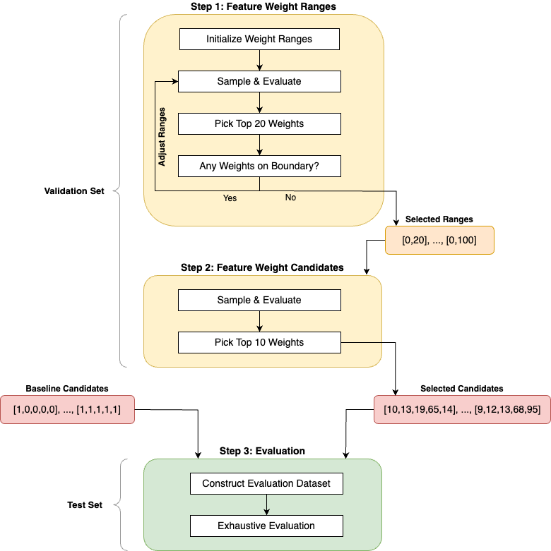
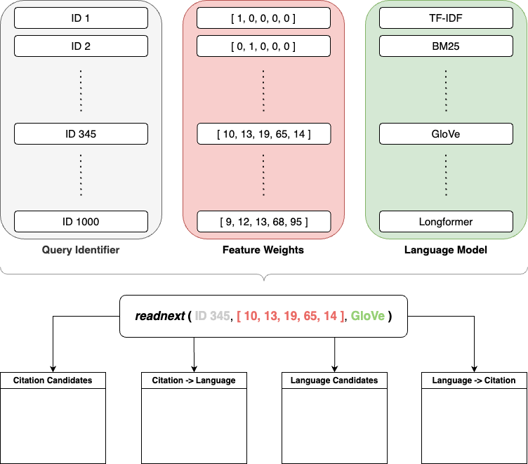

# Reproducibility

This section outlines the steps required to replicate the evaluation results featured in the thesis.


## Evaluation Results

The evaluation results are described in detail in Chapter 4.2 of the [thesis](https://github.com/joel-beck/msc-thesis/blob/main/thesis/beck-joel_masters-thesis.pdf).

The key findings are:

1. The Bibliographic Coupling feature is the most important feature for the Citation Recommender followed by the Co-Citation Analysis feature. The Paper Citation Count performs worst and is, on average, equally effective as randomly chosen papers from the training corpus.

1. The SciBERT language model performs best for the Language Recommender followed by TF-IDF and BERT. The Longformer model cannot leverage its strength on long documents and performs worst.

1. When using only a single recommender, the Language Recommender outperforms the Citation Recommender.

1. The best hybrid model is the Language -> Citation Hybrid Recommender, i.e. using the Language Recommender first for candidate selection and the Citation Recommender second for re-ranking.

1. Surprisingly, the best overall model is *not* a hybrid model, but rather the Language Recommender with the SciBERT language model alone.


## Evaluation Strategy

To effectively replicate the evaluation results, understanding the evaluation strategy is crucial. This strategy is explained comprehensively in Chapter 4.1  of the [thesis](https://github.com/joel-beck/msc-thesis/blob/main/thesis/beck-joel_masters-thesis.pdf) and summarized here.
The following figure illustrates the strategy:




### Step 1: Finding Feature Weight Ranges

The first step aims to identify appropriate ranges for the feature weights of the Citation Recommender on the validation set.
Its goal is to discover ranges that are neither too narrow nor too wide. Both extremes lead to suboptimal results:
Overly narrow ranges lead to a highly restricted search space, which may exclude the optimal feature weights.
Conversely, overly wide ranges may render the process computationally intractable. Further, the selected weights from a very broad search space may still be far from the optimal weights.

The iterative search proceeds as follows:

- Initialize all feature weight ranges with the integer interval $[0, 5]$.
- Sample $n=50$ random weight vectors and construct all combinations with the $1000$ query documents in the validation set and the $8$ language models, yielding an input space of $400,000$ values.
- Randomly sample $N=1000$ input combinations, ensuring an average of $20$ samples for each weight vector.
    Compute the marginal Mean Average Precision for all weight vectors, averaged over all query documents and language models, and analyze the $20$ top-performing candidates.
    If any weight within those vectors is at the boundaries of the current ranges, the ranges are expanded, as the optimal weights might lie outside the current ranges.
    Subsequently, the sampling and evaluation steps are repeated with the adjusted ranges.
    Conversely, if none of the weights are at the boundaries, the current ranges are deemed appropriate and the process moves to step 2.


### Step 2: Randomized Feature Weights Search

The second step, conducted on the validation set, assesses a larger number of feature weights within the ranges selected in step 1 and identifies the top $k=10$ best-performing weight vectors.

This step is performed as follows:

- Sample $n=200$ feature weight combinations from the identified ranges of step 1, resulting in $1,600,000$ input combinations, accounting for the $8$ language models and $1000$ query documents of the validation set.
- Randomly select $N=10,000$ combinations, ensuring an average of $50$ samples for each weight vector.
- Similar to step 1, compute the marginal Mean Average Precision for the weight vectors, averaged over all query documents and language models, and select the top $k=10$ candidates for the final evaluation in step 3.


### Step 3: Performance Evaluation

The third step evaluates the inference performance of various input combinations on the test set.

The evaluation procedure is as follows:

- Augment the selected feature weights of step 2 with the $6$ baseline weight vectors $[1, 0, 0, 0, 0], [0, 1, 0, 0, 0], \ldots, [0, 0, 0, 0, 1], [1, 1, 1, 1, 1]$ resulting in $k=16$ candidates.
    These simple weight combinations are added for interpretability: Each unit weight vector isolates the effect of a single feature while the vector of ones contributes the same impact to each of the five features.
    Coupled with the $8$ language models and $1000$ query documents of the test set, the evaluation dataset comprises $128,000$ combinations.
- Unlike previous steps, the evaluation is exhaustive without any prior subsampling. Inference runs for each of the $128,000$ input combinations are initiated.
    The resulting candidate and final recommendation rankings are evaluated using the Mean Average Precision.

This final step is visualized in more detail in the following figure:




## Implementation

### Feature Weight Search

The code for Steps 1 and 2 is contained in the script [`s1_search_feature_weights.py`](https://github.com/joel-beck/readnext/blob/main/readnext/scripts/evaluation/s1_search_feature_weights.py).
Hyperparameters are configured at the beginning of the `main()` function:

```python
# For both steps
seed = 42

# Step 1
num_samples_feature_weights_candidates = 50
num_samples_input_combinations = 1_000

# Step 2
num_samples_feature_weights_candidates = 200
num_samples_input_combinations = 10_000
```

The iterative search for weight ranges in step 1 requires the script to run multiple times sequentially, each time with the updated ranges from the previous run.
The current weight ranges are specified as default values in the [`FeatureWeightRanges`](https://github.com/joel-beck/readnext/blob/6407798245f7a8444f8043dbd32bbd6165d2ea52/readnext/evaluation/scoring/feature_weights.py#L57) class.

This process leads to (conservative) weight ranges of $[0, 20]$ for the publication date, paper citation count, and author citation count, and $[0, 100]$ for the co-citation analysis and bibliographic coupling features.

The specific weight candidates found in step 2 are

```md
[9, 12, 13, 68, 95],
[0, 3, 17, 96, 34],
[18, 10, 6, 83, 63],
[2, 7, 12, 15, 72],
[2, 13, 18, 72, 66],
[9, 9, 14, 9, 8, 87],
[16, 15, 5, 84, 10],
[10, 13, 19, 65, 14],
[17, 2, 18, 54, 4],
[9, 19, 20, 67, 1]
```

where the positions correspond to the order [publication date, paper citation count, author citation count, co-citation analysis, bibliographic coupling].


### Performance Evaluation

The script [`s2_compute_metrics.py`](https://github.com/joel-beck/readnext/blob/6407798245f7a8444f8043dbd32bbd6165d2ea52/readnext/scripts/evaluation/s2_compute_metrics.py) carries out the performance evaluation in Step 3.
This script requires no additional configuration.
As the evaluation is exhaustive and no subsampling is performed, no random seed is required for reproducibility.
On a standard local machine, the $128.000$ inference runs take approximately $50$ hours to complete.

To reproduce all plots and tables in the thesis, refer to the [plots](https://github.com/joel-beck/msc-thesis/tree/main/plots) directory in the [msc-thesis](https://github.com/joel-beck/msc-thesis/tree/main/plots) repository.
To use the evaluation results generated by step 3 above, set the `RESULTS_DIRPATH` environment variable to point to the same local directory in both projects.
