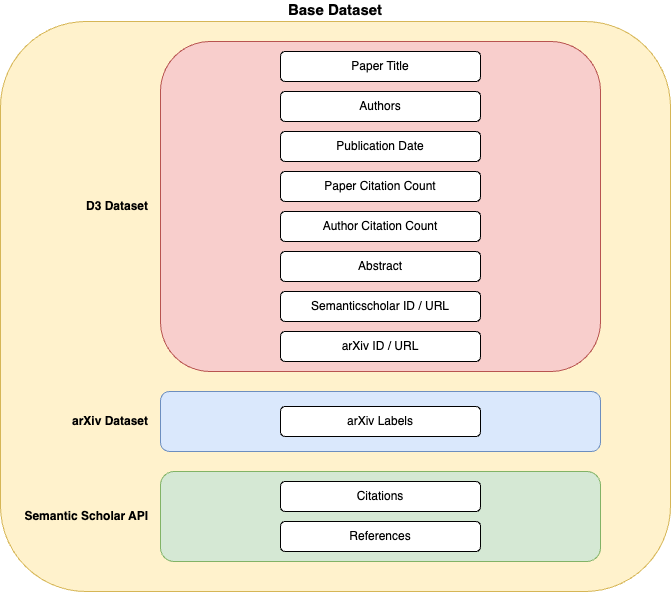

# Setup

## Data and Models

!!! note

    To execute all scripts and reproduce project results, some **local downloads** are necessary as prerequisites, including data files and pretrained models.


### Data



There are three data sources for this project:

1. **D3 Dataset**

    The [D3 DBLP Discovery Dataset](https://github.com/jpwahle/lrec22-d3-dataset/tree/main) is a compilation of metadata for over 6 million computer science papers. It is the primary data source for this project. All three global document features as well as the paper abstracts are provided by this dataset.

    The dataset consists of two files with information about documents and authors, respectively. They can be downloaded from the [Zenodo repository](https://zenodo.org/record/7071698#.ZFZnCi9ByLc).

2. **Arxiv Labels**

    Arxiv categories are used as labels for evaluating the Hybrid Recommender's performance.
    A binary classification task is defined: A candidate paper is considered a *relevant* recommendation if it shares at least one arXiV label with the query paper, and *irrelevant* otherwise.
    Arxiv labels are extracted from the [arxiv-metadata-oai-snapshot.json](https://www.kaggle.com/datasets/Cornell-University/arxiv) dataset on Kaggle.

3. **Citation Information**

    To obtain individual citations and references to compute co-citation analysis and bibliographic coupling scores, the [Semantic Scholar API](https://api.semanticscholar.org/api-docs/graph) is fetched.
    A [private API key](https://www.semanticscholar.org/product/api#api-key) is recommended for a higher request rate.


### Models

The following pretrained Word2Vec, GloVe, and FastText models are used as static embedding models:

- Pretrained [word2vec-google-news-300 Word2Vec model](https://github.com/RaRe-Technologies/gensim-data) from Gensim
- Pretrained [glove.6B GloVe model](https://nlp.stanford.edu/projects/glove/) from the Stanford NLP website
- Pretrained [English FastText model](https://fasttext.cc/docs/en/crawl-vectors.html#models) from the FastText website

## Environment Variables

`readnext` needs to know the locations of local data and model files in your file system, which can be stored in any directory.
User-specific information is provided through environment variables.
The `.env_template` file in the project root directory contains a template for the expected environment variables with default values (except for the Semantic Scholar API key):

```bash title=".env_template"
DOCUMENTS_METADATA_FILENAME="2022-11-30_papers.jsonl"
AUTHORS_METADATA_FILENAME="2022-11-30_authors.jsonl"
ARXIV_METADATA_FILENAME="arxiv_metadata.json"

SEMANTICSCHOLAR_API_KEY="ABC123"

DATA_DIRPATH="data"
MODELS_DIRPATH="models"
RESULTS_DIRPATH="results"
```

Explanation of the environment variables:

-  `DOCUMENTS_METADATA_FILENAME` and `AUTHORS_METADATA_FILENAME` correspond to the downloaded D3 dataset files, `ARXIV_METADATA_FILENAME` to the downloaded arxiv dataset file.
-  `SEMANTICSCHOLAR_API_KEY` represents the API key for the Semantic Scholar API.
-  `DATA_DIRPATH` is the directory path for all local data files, including downloaded and generated data files.
-  `MODELS_DIRPATH` is the directory path for all pretrained model files.
-  `RESULTS_DIRPATH` is the directory path for all stored result files, such as tokenized abstracts, numeric embeddings of abstracts, and precomputed co-citation analysis, bibliographic coupling, and cosine similarity scores.


## Setup Scripts

The inference step of the `readnext` package leverages preprocessed and precomputed data such that all recommender features and abstract embeddings are readily available.
To generate these files locally, run the following setup scripts in the specified order.
All scripts are located in the `readnext/scripts` directory.


1. **Dataset Construction**

    These scripts are located in the `readnext/scripts/data` directory.

    1. `s1_read_raw_data.py`: Reads documents, authors and arxiv metadata from raw JSON files and write it out into Parquet format.
    1. `s2_merge_arxiv_labels.py`: Merges the arxiv metadata with the D3 dataset via the arxiv id. Adds arxiv labels as new feature to the dataset which are later used as ground-truth labels for the recommender system.
    1. `s3_merge_authors.py`: Adds the author citationcount to the dataset and selects the most popular author for each document.
    1. `s4_add_citations.py`: Sends requests to the semanticscholar API to obtain citation and reference urls for all documents in the dataset and add them as features to the dataframe.
    1. `s5_add_ranks.py`: Adds rank features for global document characteristics (publication date, document citation count and author citation count) to the dataset and selects a subset of the most cited documents for the final dataset.


All further script paths are relative to the `readnext/scripts/modeling` directory.


2. **Citation Models**

    1. `run_co_citation_analysis.py`: Precomputes co-citation analysis scores for all document pairs in the dataset.
    1. `bibliographic_coupling.py`: Precomputes bibliographic coupling scores for all document pairs in the dataset.


3. **Language Models**

    1. `tokenizer/run_tokenizer.py`: Tokenizes the abstracts of all documents in the dataset by four different tokenizers into the appropriate format for all eight language models.
    1. `embedder/run_embedder_*.py`: These scripts generate sparse or dense numeric embeddings of all document abstracts for each language model. The process is split into separate scripts for each model to allow for easy parallelization.
    1. `cosine_similarities/run_cosine_similarities_*.py`: Precomputes cosine similarity scores for all document pairs in the dataset for each language model. Again, multiple scripts are used for parallelization purposes.

    !!! note

        The `run_embedder_*.py` and `run_cosine_similarities_*.py` scripts are independent between different language models!
        That means that you can run a subset of scripts only for those language models that you want to use for the recommender system.
        For example, if you are only interested in the Longformer language model, it is sufficient to run the scripts `run_embedder_longformer.py` and `run_cosine_similarities_longformer.py` in steps b and c, respectively.


## Development Workflow

This project utilizes [pdm](https://pdm.fming.dev/) for package and dependency management.
To install `pdm`, follow the [installation instructions](https://pdm.fming.dev/latest/#installation) on the pdm website.

Pdm provides the option to define [user scripts](https://pdm.fming.dev/latest/usage/scripts/) that can be run from the command line.
These scripts are specified in the `pyproject.toml` file in the `[tool.pdm.scripts]` section.

The following built-in and custom user scripts are useful for the development workflow:

-  `pdm add <package name>`: Add and install a new (production) dependency to the project.
    They are automatically added to the `[project]` -> `dependencies` section of the `pyproject.toml` file.
-  `pdm add -dG dev <package name>`: Add and install a new development dependency to the project.
    They are automatically added to the `[tool.pdm.dev-dependencies]` section of the `pyproject.toml` file.
-  `pdm remove <package name>`: Remove and uninstall a dependency from the project.
-  `pdm format`: Format the entire project with [black](https://github.com/psf/black).
    The black configuration is specified in the `[tool.black]` section of the `pyproject.toml` file.
-  `pdm lint`: Lint the entire project with the [ruff](https://github.com/charliermarsh/ruff) linter.
    The ruff configuration is specified in the `[tool.ruff.*]` sections of the `pyproject.toml` file.
-  `pdm check`: Static type checking with [mypy](https://github.com/python/mypy).
    The mypy configuration is specified in the `[tool.mypy]` section of the `pyproject.toml` file.
-  `pdm test*`: Collection of commands to run unit tests with [pytest](https://github.com/pytest-dev/pytest).
    The pytest configuration is specified in the `[tool.pytest.ini_options]` section of the `pyproject.toml` file.
    The individual commands are:
    -  `pdm test`: Run all unit tests.
    -  `pdm test-cov`: Run all unit tests and generate a test coverage report.
    -  `pdm test-fast`: Run only tests without extensive computations. Useful for a quick feedback loop during development.
    -  `pdm test-slow`: Opposite of the `pdm test-fast` command. Runs only tests that require significant computation time.
    -  `pdm test-ci`: Run only tests that are executed in the continuous integration pipeline. This excludes all tests that depend on precomputed local data files not available in the CI environment.
-  `pdm pre`: Run [pre-commit](https://github.com/pre-commit/pre-commit) on all files.
    All pre-commit hooks are specified in the `.pre-commit-config.yaml` file in the project root directory.
-  `pdm serve`: Preview the project documentation locally.
-  `pdm deploy`: Deploy the project documentation to GitHub pages.
